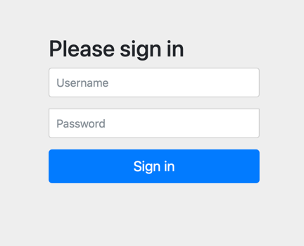

# 认证中心使用指引

## 引入依赖

```groovy
implementation 'org.springframework.boot:spring-boot-starter-web'
implementation 'org.springframework.boot:spring-boot-starter-security'
implementation 'org.springframework.cloud:spring-cloud-starter-bootstrap'
```

## 启动应用

在浏览器中输入<http://localhost:11011>，会进入 spring security 默认的登陆页面


默认用户名为：user 默认密码，密码会在应用启动的时候输出在控制台

该随机密码是由 ```UserDetailsServiceAutoConfiguration``` 配置产生的。

## UserDetailsService 接口

该接口只提供了一个接口方法，通过用户名获取用户信息。

```java
  UserDetails loadUserByUsername(String username)throws UsernameNotFoundException;
```

## UserDetails

用户信息的核心接口，该接口的实现仅仅储存了用户的信息，后续会将该接口提供的用户信息封装到认证对象 ``` Authentication```
中去，该接口默认提供了：

- 用户在应用内的唯一用户名
- 加密后的密码，不加密使用 ``` {noop} ```前缀
- 用户的权限集，默认要加上 ``` ROLE_ ``` 前缀
- 账户是否过期
- 账户是否锁定
- 凭证是否过期
- 账户是否可用

如果信息无法满足需求，可以自行扩展使用，自行实现 UserDetails 接口 即可。  
通常会使用UserDetails的内置实现类 ``` org.springframework.security.core.userdetails.User ```
该类内置了一个建造器 UserBuilder ,会很方便的帮助我们构造它。

## UserDetailsServiceAutoConfiguration

SpringBoot 的 UserDetailsService 自动配置类，源码如下：

```java
package org.springframework.boot.autoconfigure.security.servlet;

@Configuration(
        proxyBeanMethods = false
)
@ConditionalOnClass({AuthenticationManager.class})
@ConditionalOnBean({ObjectPostProcessor.class})
@ConditionalOnMissingBean(
        value = {AuthenticationManager.class, AuthenticationProvider.class, UserDetailsService.class},
        type = {"org.springframework.security.oauth2.jwt.JwtDecoder", "org.springframework.security.oauth2.server.resource.introspection.OpaqueTokenIntrospector"}
)
public class UserDetailsServiceAutoConfiguration {
    private static final String NOOP_PASSWORD_PREFIX = "{noop}";
    private static final Pattern PASSWORD_ALGORITHM_PATTERN = Pattern.compile("^\\{.+}.*$");
    private static final Log logger = LogFactory.getLog(UserDetailsServiceAutoConfiguration.class);

    public UserDetailsServiceAutoConfiguration() {
    }

    @Bean
    @ConditionalOnMissingBean(
            type = {"org.springframework.security.oauth2.client.registration.ClientRegistrationRepository"}
    )
    @Lazy
    public InMemoryUserDetailsManager inMemoryUserDetailsManager(SecurityProperties properties, ObjectProvider<PasswordEncoder> passwordEncoder) {
        User user = properties.getUser();
        List<String> roles = user.getRoles();
        return new InMemoryUserDetailsManager(new UserDetails[]{org.springframework.security.core.userdetails.User.withUsername(user.getName()).password(this.getOrDeducePassword(user, (PasswordEncoder) passwordEncoder.getIfAvailable())).roles(StringUtils.toStringArray(roles)).build()});
    }

    private String getOrDeducePassword(User user, PasswordEncoder encoder) {
        String password = user.getPassword();
        if (user.isPasswordGenerated()) {
            logger.info(String.format("%n%nUsing generated security password: %s%n", user.getPassword()));
        }

        return encoder == null && !PASSWORD_ALGORITHM_PATTERN.matcher(password).matches() ? "{noop}" + password : password;
    }
}

```

    @Conditional(TestCondition.class)

    这句代码可以标注在类上面，表示该类下面的所有@Bean都会启用配置，也可以标注在方法上面，只是对该方法启用配置。
    
    @ConditionalOnBean（仅仅在当前上下文中存在某个对象时，才会实例化一个Bean）
    @ConditionalOnClass（某个class位于类路径上，才会实例化一个Bean）
    @ConditionalOnExpression（当表达式为true的时候，才会实例化一个Bean）
    @ConditionalOnMissingBean（仅仅在当前上下文中不存在某个对象时，才会实例化一个Bean）
    @ConditionalOnMissingClass（某个class类路径上不存在的时候，才会实例化一个Bean）
    @ConditionalOnNotWebApplication（不是web应用）

该类在类路径下存在AuthenticationManager   
当 Spring 容器中存在Bean ObjectPostProcessor    
并且不存在Bean AuthenticationManager AuthenticationProvider UserDetailsService 的情况下才会加载

该类只是初始化了一个 UserDetailsManager 的Bean 负责对安全用户实体抽象 UserDetails 进行增删改查操作，同时还继承了 UserDetailsService 接口

该类初始化了一个名为InMemoryUserDetailsManager 的内存用户管理器。该管理器通过配置注入了一个默认的UserDetails存在内存中，就是我们上面用的那个user ，每次启动user都是动态生成的。

## 自定义UserDetailsManager

在配置文件中配置默认用户名/密码

```yaml
security:
  user:
    name: admin
    password: admin
```