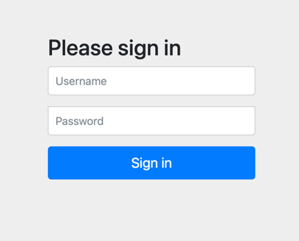

授权服务器配置类 需要使用 @EnableAuthorizationServer 注解并集成 AuthorizationServerConfigurerAdapter 来配置 OAuth2.0 授权服务器
AuthorizationServerConfigurerAdapter 要求配置以下几个类，这几个类是由Spring创建的独立配置对象，他们会被Spring传入 AuthorizationServerConfigurer 进行配置

- ClientDetailsServiceConfigurer:
  用来配置客户端详情服务（ClientDetailService）,客户端详情信息在这里进行初始化，你可以把客户端详情信息写死在这里或者通过数据库来配置，我们这边写死在这里就好了
  AuthorizationServerEndpointsConfigurer: 用来配置令牌（token）的访问断电和令牌服务（token services） AuthorizationServerSecurityConfigurer:
  用来配置令牌端点的安全约束

配置客户端详细信息 ClientDetailsServiceConfigurer 负责查找 ClientDetails，而ClientDetails 有几个重要属性如表：

属性名 作用 clientId 必须的 用来标识客户端的id secret 需要值得信任的客户端 ， 客户端安全码，如果有的话 scope 用来限制客户端的访问范围，如果为空（默认），那么客户端拥有全部的访问范围
authorizedGrantTypes 由此客户端可以使用的授权类型，默认为空 authorities 此客户端可以使用的权限（基于SpringSecurity authorities） 客户端详情（client
details）能够在应用程序运行的时候进行更新，可以通过访问底层的存储服务，例如将客户端向高清存储在一个关系数据库的表中，你就可以使用jdbcClientDetailsService 或者通过自己实现
ClientDetailsService 来进行管理

管理令牌 AuthorizatonServerTokenService 接口定义了一些操作使你可以进行一些必要的管理，令牌可以被用来加载身份信息。

- InMemoryTokenStore:
  这个版本是被默认采用的。 我们的授权认证也是基于这个 JdbcTokenStore: 这是一个基于JDBC的版本，看名字也知道，使用的时候需要 引入依赖spring-jdbc JwtTokenStore: 这个版本全程是 JSON
  Web Token (Jwt)
  他可以吧令牌相关的数据进行编码，因此对于后台来说，他不需要进行存储，这是一个优势，但是他也有一个缺点，那就是撤销一个已经授权的令牌将会非常困难，所以它通常用来处理一个生命周期比较短的令牌以及撤销刷新令牌(refresh_token)
  。另一个缺点就是这个令牌占用的空间比较大，如果你加入了比较多的用户凭证信息，Jwt不会保存任何数据。 我们这边选择内存方式。

配置授权类型（Grant Types） AuthorizationServerEndpointsConfigurer 通过设定以下属性支持的授权类型（GrantTypes） authenticationManager:
认证管理器，当你选择了资源所有者密码(password)授权类型的时候，请设置这个属性注入一个AuthenticationManager对象 userDetailsService
如果你设置这个属性的话，说明你有一个自己的UserDetailsService接口的实现。 authorizationCodeServices： 这个属性是用来设置授权码服务的，主要用于authorization_code授权码类型模式
implicatGrantService: 设置隐式授权模式，用来管理隐式授权模式的状态 toeknGranter 授权将会交给你自己来完全掌控

# Resource Server

@EnableResourceServer 注解到一个@Configuration 配置类上，并且必须使用 ResourceServerConfigurer 这个配置对象来进行配置。 下面是一些可以配置的属性

```text
tokenServices：ResourceServerTokenServices 类的实例，用来实现令牌服务 
tokenStore：TokenStore类的实力，制定令牌如何访问，与tokenServices 配置可选
resourceId ： 这个资源服务器的id，这个属性是可选的，但是推荐设置并在授权服务中进行验证 其他的拓展例tokenExtractor 令牌提取器用来提取请求中的令牌.
HttpSecurity 配置这个与 SpringSecurity 类似请求匹配器，用来设置需要进行保护的资源路径，默认的情况下是保护资源服务器全部路径。 
通过http.authorizeRequests() 来设置受保护资源的访问规则 其他的自定义权限保护规则通过 httpSecurity 来进行配置
```

@EnableResourceServer 注解自动增加了一个类型为Oauth2AuthenticationProcessingFilter 的过滤器链

# JWT

Json Web Token （JWT） 近几年是前后端分离常用的 Token 技术，是目前最流行的跨域身份验证解决方案。你可以通过文章 一文了解web无状态会话token技术JWT 来了解 JWT。今天我们来手写一个通用的 JWT 服务。

## spring-security-jwt

spring-security-jwt 是 Spring Security Crypto 提供的 JWT 工具包 。

```groovy
implementation 'org.springframework.security:spring-security-jwt:1.1.1.RELEASE'
```

核心类只有一个: org.springframework.security.jwt.JwtHelper 。它提供了两个非常有用的静态方法

## JWT 编码

JwtHelper 提供的第一个静态方法是 encode(CharSequence content, Signer signer)，这个是用来生成jwt的方法 需要指定 payload 跟 signer 签名算法。payload
存放了一些可用的不敏感信息：

- iss jwt签发者
- sub jwt所面向的用户
- aud 接收jwt的一方
- iat jwt的签发时间
- exp jwt的过期时间，这个过期时间必须要大于签发时间 iat
- jti jwt的唯一身份标识，主要用来作为一次性token,从而回避重放攻击

除了以上提供的基本信息外，我们可以定义一些我们需要传递的信息，比如目标用户的权限集 等等。切记不要传递密码等敏感信息 ，因为 JWT 的前两段都是用了 BASE64 编码，几乎算是明文了

### 构建 JWT 中的 payload

通过建造类 JwtClaimsBuilder 我们可以很方便来构建 JWT 所需要的 payload json 字符串传递给 encode(CharSequence content, Signer signer) 中的 content

### 生成 RSA 密钥并进行签名

为了生成 JWT Token 我们还需要使用 RSA 算法来进行签名。 这里我们使用 JDK 提供的证书管理工具 Keytool 来生成 RSA 证书 ，格式为 jks 格式。

```shell
keytool -genkey -alias penguinscn -keypass penguinscn -keyalg RSA -storetype PKCS12 -keysize 1024 -validity 365 -keystore /Users/zhengbing/keystores/penguins.jks -storepass 123456  -dname "CN=(Penguins), OU=(penguinscn), O=(penguinscn), L=(zz), ST=(hn), C=(cn)"
```

## JWT 解码

# UserDetail

# 认证中心使用指引

## 引入依赖

```groovy
implementation 'org.springframework.boot:spring-boot-starter-web'
implementation 'org.springframework.boot:spring-boot-starter-security'
implementation 'org.springframework.cloud:spring-cloud-starter-bootstrap'
```

## 启动应用

在浏览器中输入<http://localhost:11011>，会进入 spring security 默认的登陆页面


默认用户名为：user 默认密码，密码会在应用启动的时候输出在控制台

该随机密码是由 ```UserDetailsServiceAutoConfiguration``` 配置产生的。

## UserDetailsService 接口

该接口只提供了一个接口方法，通过用户名获取用户信息。

```java
  UserDetails loadUserByUsername(String username)throws UsernameNotFoundException;
```

## UserDetails

用户信息的核心接口，该接口的实现仅仅储存了用户的信息，后续会将该接口提供的用户信息封装到认证对象 ``` Authentication```
中去，该接口默认提供了：

- 用户在应用内的唯一用户名
- 加密后的密码，不加密使用 ``` {noop} ```前缀
- 用户的权限集，默认要加上 ``` ROLE_ ``` 前缀
- 账户是否过期
- 账户是否锁定
- 凭证是否过期
- 账户是否可用

如果信息无法满足需求，可以自行扩展使用，自行实现 UserDetails 接口 即可。  
通常会使用UserDetails的内置实现类 ``` org.springframework.security.core.userdetails.User ```
该类内置了一个建造器 UserBuilder ,会很方便的帮助我们构造它。

## UserDetailsServiceAutoConfiguration

SpringBoot 的 UserDetailsService 自动配置类，源码如下：

```java
package org.springframework.boot.autoconfigure.security.servlet;

@Configuration(
        proxyBeanMethods = false
)
@ConditionalOnClass({AuthenticationManager.class})
@ConditionalOnBean({ObjectPostProcessor.class})
@ConditionalOnMissingBean(
        value = {AuthenticationManager.class, AuthenticationProvider.class, UserDetailsService.class},
        type = {"org.springframework.security.oauth2.jwt.JwtDecoder", "org.springframework.security.oauth2.server.resource.introspection.OpaqueTokenIntrospector"}
)
public class UserDetailsServiceAutoConfiguration {
    private static final String NOOP_PASSWORD_PREFIX = "{noop}";
    private static final Pattern PASSWORD_ALGORITHM_PATTERN = Pattern.compile("^\\{.+}.*$");
    private static final Log logger = LogFactory.getLog(UserDetailsServiceAutoConfiguration.class);

    public UserDetailsServiceAutoConfiguration() {
    }

    @Bean
    @ConditionalOnMissingBean(
            type = {"org.springframework.security.oauth2.client.registration.ClientRegistrationRepository"}
    )
    @Lazy
    public InMemoryUserDetailsManager inMemoryUserDetailsManager(SecurityProperties properties, ObjectProvider<PasswordEncoder> passwordEncoder) {
        User user = properties.getUser();
        List<String> roleInfos = user.getRoles();
        return new InMemoryUserDetailsManager(new UserDetails[]{org.springframework.security.core.userdetails.User.withUsername(user.getName()).password(this.getOrDeducePassword(user, (PasswordEncoder) passwordEncoder.getIfAvailable())).roleInfos(StringUtils.toStringArray(roleInfos)).build()});
    }

    private String getOrDeducePassword(User user, PasswordEncoder encoder) {
        String password = user.getPassword();
        if (user.isPasswordGenerated()) {
            logger.info(String.format("%n%nUsing generated security password: %s%n", user.getPassword()));
        }

        return encoder == null && !PASSWORD_ALGORITHM_PATTERN.matcher(password).matches() ? "{noop}" + password : password;
    }
}

```

    @Conditional(TestCondition.class)

    这句代码可以标注在类上面，表示该类下面的所有@Bean都会启用配置，也可以标注在方法上面，只是对该方法启用配置。
    
    @ConditionalOnBean（仅仅在当前上下文中存在某个对象时，才会实例化一个Bean）
    @ConditionalOnClass（某个class位于类路径上，才会实例化一个Bean）
    @ConditionalOnExpression（当表达式为true的时候，才会实例化一个Bean）
    @ConditionalOnMissingBean（仅仅在当前上下文中不存在某个对象时，才会实例化一个Bean）
    @ConditionalOnMissingClass（某个class类路径上不存在的时候，才会实例化一个Bean）
    @ConditionalOnNotWebApplication（不是web应用）

该类在类路径下存在AuthenticationManager   
当 Spring 容器中存在Bean ObjectPostProcessor    
并且不存在Bean AuthenticationManager AuthenticationProvider UserDetailsService 的情况下才会加载

该类只是初始化了一个 UserDetailsManager 的Bean 负责对安全用户实体抽象 UserDetails 进行增删改查操作，同时还继承了 UserDetailsService 接口

该类初始化了一个名为InMemoryUserDetailsManager 的内存用户管理器。该管理器通过配置注入了一个默认的UserDetails存在内存中，就是我们上面用的那个user ，每次启动user都是动态生成的。

## 自定义UserDetailsManager

在配置文件中配置默认用户名/密码

```yaml
security:
  user:
    name: admin
    password: admin
```