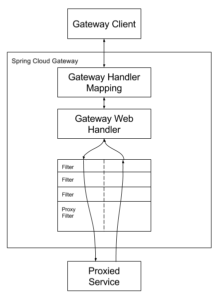

# 网关配置

## 引入依赖

```groovy
implementation 'org.springframework.cloud:spring-cloud-starter-gateway'
```

## 添加配置

### 默认路由配置

```yaml
spring:
  cloud:
    gateway:
    discovery:
      locator:
        # 表示将请求路径的服务名配置改成小写,因为服务注册的时候，向注册中心注册时将服务名转成大写的了
        lowerCaseServiceId: true
        # 表示gateway开启服务注册和发现功能,
        # 并且spring cloud gateway 自动根据服务发现为每一个服务创建了一个router，这个router将以服务名开头的请求路径转发到对应的服务
        enabled: true
    httpclient:
      response-timeout: 5000
      connect-timeout: 5000
```

### 默认路由调试

<http://localhost:801/cloud-penguins-auth/test/getConfig>

### 自定义路由配置

```yaml
    routes:
      - id: auth
        uri: http://localhost:11011 # 请求要转发到的地址
        order: 1                      # 路由的优先级,数字越小级别越高
        predicates: # 断言(就是路由转发要满足的条件)
          - Path=/auth/**             # 当请求路径满足Path指定的规则时,才进行路由转发
        filters: # 过滤器,请求在传递过程中可以通过过滤器对其进行一定的修改
          - StripPrefix=1 # 转发之前去掉1层路径
```

### 自定义路由调试

<http://localhost:801/auth/test/getConfig>

# 网关配置详解

## 关键词汇

- route（路由）路由是网关最基础的组件   
  **ID** 来定义一个唯一应用路由   
  **URI** 来定义路由请求的目标应用   
  **predicates(断言)**    route下面的一个集合属性 --就是路由转发要满足的条件   
  **filters(过滤器)**     route下面的一个集合属性 --过滤器,请求在传递过程中可以通过过滤器对其进行一定的修改

- predicates
  使用Java 8 的新特性 predicate，输入类型是 Spring Framework ServerWebExchange. 可以用来匹配 HTTP 请求中的任意属性，例如：Headers 或者 parameters

- filter

  这些是由特定工厂建造的 GatewayFilter 的实例。 在这里，您可以在发送下游请求之前或之后修改请求和响应。

## 网关运行原理

